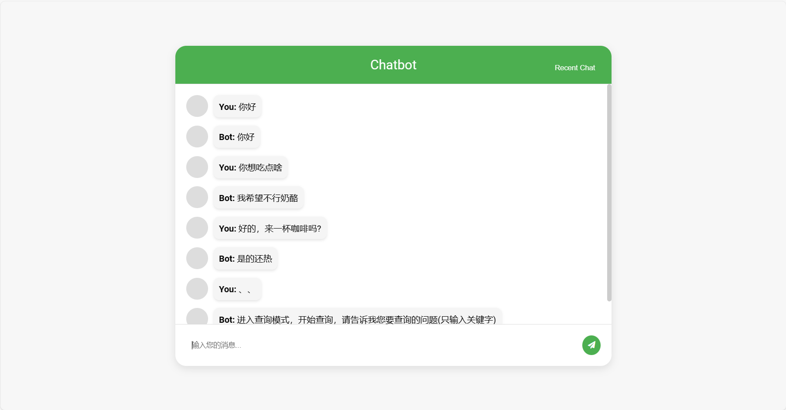
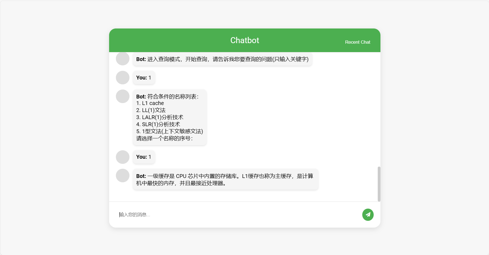
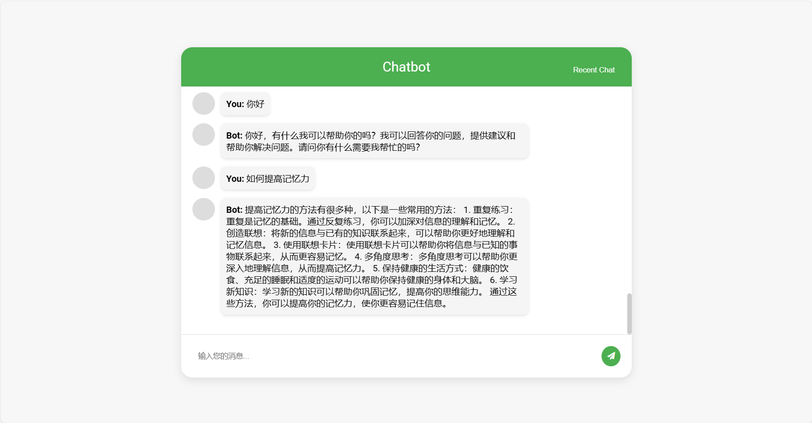
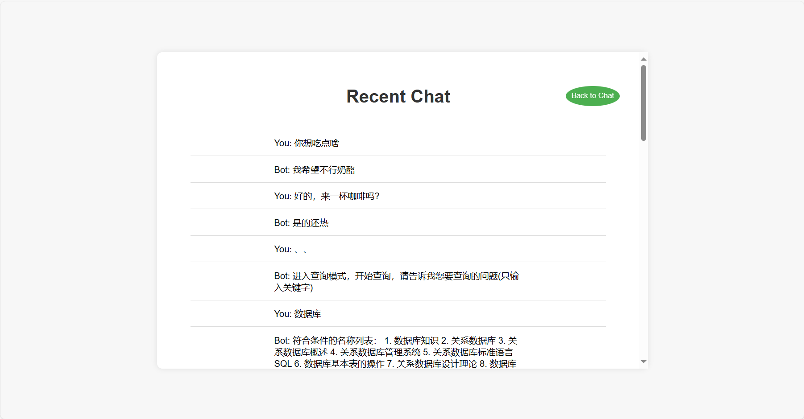

# **一个聊天&查询机器人**
## 简介
本项目是一个基于Seq2Seq结构的中文聊天机器人，同时具备问答查询计算机知识的功能。项目采用了pytorch、flask、mysql、redis、html、css、js等技术。

本项目的Seq2Seq，使用了注意力机制来增强解码器的性能，帮助解码器更好地关注编码器的输出，使其能够更好地捕捉输入序列中的信息，且其中使用的是RNN的改进版——GRU。
GRU通过引入门控机制（更新门和重置门），可以更好地控制梯度的流动，从而缓解了梯度消失的问题，使得模型能够学习到更长距离的依赖关系，同时也允许模型更有选择性地传递隐藏状态，更新门决定隐藏状态的哪一部分应该被保留或更新，而重置门决定输入的哪一部分应该被忽略或考虑。此外，GRU在每个时间步共享参数，这减少了模型的参数数量，有助于减轻过拟合的风险。

## 关于GRU门控机制的通俗解释：

想象一下你正在尝试记住一个长故事中的所有细节。如果故事非常长，那么记住故事开头发生的事情可能会很困难，因为你的大脑会逐渐“忘记”或失去对早期信息的关注。

GRU（门控循环单元）的引入就是为了解决这个问题。它通过使用“门”来控制信息的流动。这些“门”可以决定哪些信息是重要的，需要保留和传递到下一个时间步，哪些信息则可以忽略。

这就像是你有一个过滤系统，它帮助你专注于故事中的关键部分，并且只记住那些重要的细节。这样，即使你在阅读或听取一个很长的故事，你也能够记住很久以前发生的关键事件，并且理解它们与当前事件之间的关系。

在NLP中，这对于整体的语义理解与记忆是比较重要的。
## 训练网络结构：
- EncoderRNN：

定义了Seq2Seq模型的编码器部分。
它使用一个nn.Embedding层将输入序列的词索引转换为词向量。
然后，它通过一个GRU（门控循环单元）层来处理这些词向量。配置中指定了bidirectional= True，使用的是双向GRU。
编码器的输出是一个经过GRU层处理的序列，以及最终的隐藏状态。
- Attn ：

实现了注意力机制，它允许解码器在生成输出序列时关注输入序列的不同部分。
它提供了三种不同的注意力计算方法：'dot', 'general', 和 'concat'。
使用forward方法来计算注意力权重，并将这些权重应用于编码器的输出。
- LuongAttnDecoderRNN：

定义了Seq2Seq模型的解码器部分，使用了Luong等人提出的注意力机制。
它同样包含一个nn.Embedding层，并且有一个dropout层来降低过拟合的风险。
解码器使用一个GRU层来处理词嵌入，并且能够接收编码器的输出和上一个时间步的隐藏状态。
它使用attn对象来计算注意力权重，并将这些权重应用于编码器的输出，以生成上下文向量。
最后，解码器将GRU的输出和上下文向量拼接起来，通过一个线性层和激活函数，最终输出下一个词的概率分布。
## 原数据
- **聊天训练语料**：来源于[zhdd_lines.txt](https://github.com/zll17/Neural_Topic_Models/blob/master/data/zhdd_lines.txt)。在此基础上稍作更改形成了根目录的zhdd_lines-min.tsv文件，包含1.2w行数据。经过处理后，zhdd_lines-min_new.tsv将包含大约8.5w轮对话。
- **计算机知识数据**：来源于[JSONfromHTML.json](https://github.com/OxfordStreet/QAComputerKG/blob/main/data/JSONfromHTML.json)。数据已放入computer_knowledge文件夹中，共700+条数据。
## 训练步骤
0. **环境配置**
    - 安装mysql与redis，推荐使用docker进行安装，快捷方便。
    - 修改`redis_data.py`中的port和password为自己的。
    - 修改`create_json_to_mysql.py`中的数据库连接信息，包括密码和端口。
1. **安装依赖**
    - 运行`$ pip install -r requirements.txt`安装所需依赖。
2. **数据预处理**
    - 运行`create_json_to_mysql.py`，将computer_knowledge文件夹下的JSONfromHTML.json文件里的计算机知识点写入mysql数据库。
    - 运行`data_preprocess_round_one.py`，处理zhdd_lines-min.tsv原文件，生成新的tsv文件zhdd_lines-min_new.tsv。（已处理，文件夹下已有新tsv文件）
    - 运行`data_preprocess_round_two.py`，处理新tsv文件，生成字典和句子索引文件processed_conversation_dataset.pth。（已处理，文件夹下已有pth文件）
3. **模型训练**
    - 运行`begin_train_and_save_model.py`，训练并保存chatbot_model_{epoch}_{print_loss_avg:.2f}.pth模型。（已处理，根目录下已有初步训练的模型chatbot_model.pth）
4. **启动服务**
    - 运行`main_and_app.py`，生成本地服务器的地址，复制进入浏览器即可访问聊天页面。
## 功能介绍
此ChatBot有两种模式：聊天模式和查询模式。
- 默认初始进入的是聊天模式。
- 在聊天框中输入"、、"进入查询模式，开始查询计算机知识。在查询模式中，输入"、"返回上级，输入"、、"则直接退出查询模式。
- 输入"choose"可以选择与您聊天的机器人模型，包括自己训练的小模型chatbot和已本地化部署的开源模型ChatLM-mini-Chinese，本来本地化部署的是chatglm-6b-int4，无奈个人电脑GPU内存不满足，而ChatLM-mini-Chinese则比较友好，只占用接近2G的GPU内存。附ChatLM-mini-Chinese地址(https://github.com/charent/ChatLM-mini-Chinese/tree/main)
## 模型对比
- **chatbot**：基于较小的数据集（8.5w）和较短的训练时间（用时几个小时；本地训练太慢，因此在Kaggle平台上借用免费又同时更强的GPU进行训练），神经网络层数和参数较少，更快出训练成果，适合时间精力有限的人群。
- **ChatLM-mini-Chinese**：基于较大的数据集（1000w），具有更深的层数和更多的参数，训练时间相对较长。
## 截图
- **chatbot**：
    
- **查询模式**：
    
- **ChatLM-mini-Chinese**：
    
- **Recent Chat**：
    
点击右上角进入Recent Chat，其中包含用redis缓存的30条信息。
